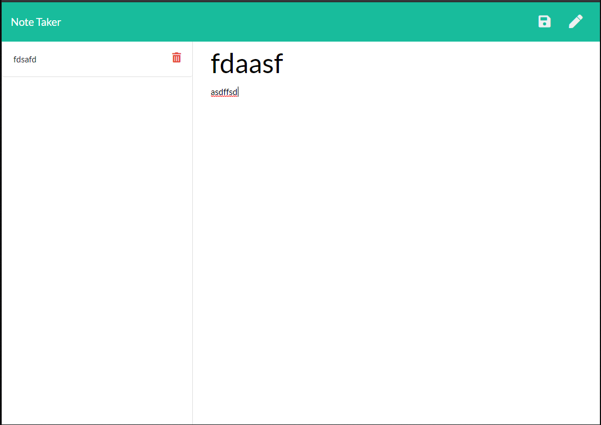

# Note Taker
In this project i was able to create a note taking app that runs off of an express server in order to display and run both the html and js that handles added the notes and saving the m plus deleting whichever notes yo uplease

## How to use the app
.gif)
## Image of the Website

## Built With

* [Javascript](https://www.javascript.com/)
* [HTML](https://developer.mozilla.org/en-US/docs/Web/HTML)
* [Node.js](https://nodejs.org/en/)
* [NPM](https://www.npmjs.com/)
* [Express](https://expressjs.com/)

## Code Snippet
    The code below is how i routed the files used in my app in order to get the front end of the app when the server is created.
    
    app.get("/notes", function(req, res) {
    res.sendFile(path.join(__dirname, "/public/notes.html"));
    });

    app.get("/api/notes", function(req, res) {
        res.sendFile(path.join(__dirname, "/db/db.json"));
      });

      app.get("*", function(req, res) {
        res.sendFile(path.join(__dirname, "/public/index.html"));
    });

## Github Repository
- [Note Taker Repo](https://github.com/GabrielPineda808/note-taker)
## Authors

* **Gabriel Pineda** 

- [Link to Github](https://github.com/GabrielPineda808)
- [Link to LinkedIn](https://www.linkedin.com/in/gabriel-pineda-a94535195/)